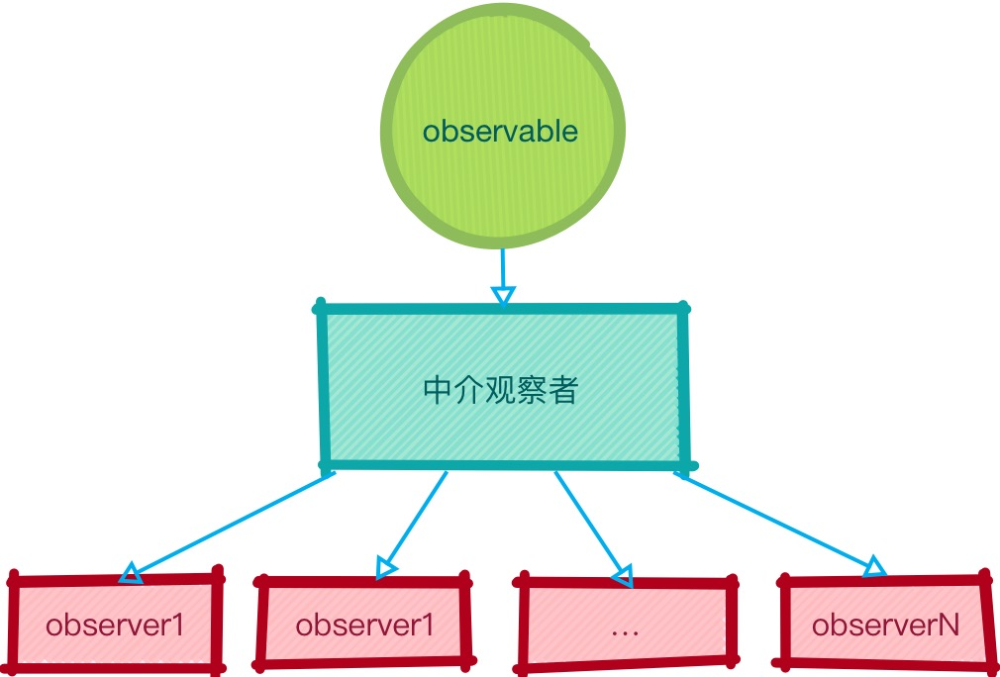
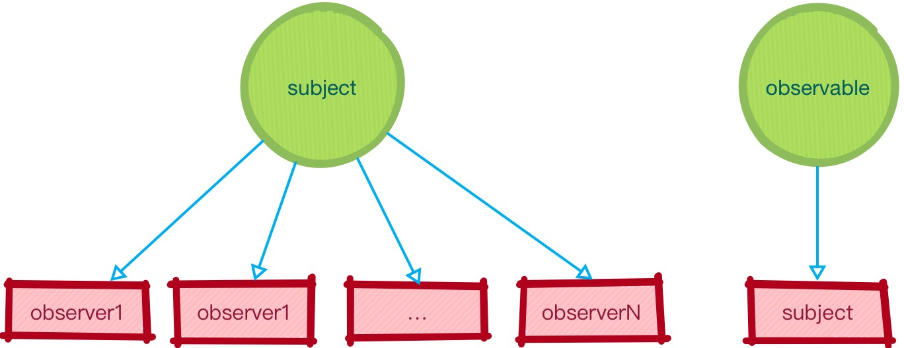

# Subject

在上一节中，我们实现两个一个 Observable 对象能够广播两个 Observer：

```js
const observable = Rx.Observable.interval(1000).take(6);

const observerA = {
  next: x => {
    console.log(`A next ${x}`);
    observerB.next(x);
  },
  error: e => {
    console.error(`A error ${e}`);
    observerB.error(e);
  },
  complete: () => {
    console.log('A done');
    observerB.complete();
  }
};

observable.subscribe(observerA);

const observerB = {
  next: x => console.log(`B next ${x}`),
  error: e => console.error(`B error ${e}`),
  complete: () => console.log('B done')
};
```

如果我们还想广播第三个、第四个、第 n 个 Observer，则只能：

```js
const observable = Rx.Observable.interval(1000).take(6);

const observerA = {
  next: x => {
    console.log(`A next ${x}`);
    observerB.next(x);
    observerC.next(x);
    observerD.next(x);
    // ....
    observerXXX.next(x);
  },
  error: e => {
    console.error(`A error ${e}`);
    observerB.error(e);
    observerC.error(e);
    observerD.error(e);
    // ....
    observerXXX.error(e);
  },
  complete: () => {
    console.log('A done');
    observerB.complete();
    observerC.complete();
    observerD.complete();
    // ....
    observerXXX.complete();
  }
};

observable.subscribe(observerA);

const observerB = {
  next: x => console.log(`B next ${x}`),
  error: e => console.error(`B error ${e}`),
  complete: () => console.log('B done')
};
```

很瓜皮的做法，但也给了我们启发，我们可以设置一个中介观察者，他主要完成两件事儿：

- 观察 `observable`。
- 保存了一个观察者列表，当观察到 `observable` 变动时，由中介广播列表中的各个观察者。

<div style="text-align:center">
</img>
</div>

```js
const observable = Rx.Observable.interval(1000).take(6);

const bridgeObserver = {
  observers: [],
  next: function(v) {
    this.observers.forEach(observer => observer.next(v));
  },
  error: function(e) {
    this.observers.forEach(observer => observer.error(e));
  },
  complete: function() {
    this.observers.forEach(observer => observer.complete());
  },
  addObserver: function(observer) {
    this.observers.push(observer);
  }
};

const observerA = {
  next: x => console.log(`A next ${x}`),
  error: e => console.error(`A error ${e}`),
  complete: () => console.log('A done')
};

observable.subscribe(bridgeObserver);
bridgeObserver.addObserver(observerA);

const observerB = {
  next: x => console.log(`B next ${x}`),
  error: e => console.error(`B error ${e}`),
  complete: () => console.log('B done')
};

setTimeout(() => {
  bridgeObserver.addObserver(observerB);
}, 2000);

/* 程序输出：
  "A next 0"
  "A next 1"
  "A next 2"
  "B next 2"
  "A next 3"
  "B next 3"
  "A next 4"
  "B next 4"
  "A next 5"
  "B next 5"
  "A done"
  "B done"
 */
```

[查看例子](http://jsbin.com/nesazu/9/edit?js,console)

我们看到，列表中的各个观察者实际上也是在 **观察着** 中介，所以，我们不妨将 `addObserver` 命名为 `subscribe`：

```js
const bridgeObserver = {
  observers: [],
  next: function(v) {
    this.observers.forEach(observer => observer.next(v));
  },
  error: function(e) {
    this.observers.forEach(observer => observer.error(e));
  },
  complete: function() {
    this.observers.forEach(observer => observer.complete());
  },
  subscribe: function(observer) {
    this.observers.push(observer);
  }
};

// ...

observable.subscribe(bridgeObserver);
bridgeObserver.subscribe(observerA);

// ....

setTimeout(() => {
  bridgeObserver.subscribe(observerB);
}, 2000);
```

现在，这个中介便成为了一个可供观察的 Observable，再考虑到中介也在观察着某个 Observable，他就是一个具备 **双重身份** 的对象，既是 Observable 对象，又是 Observer 对象。RxJS 也为我们提供了这样一个具有双重身份的对象 -- **Subject**：

<div style="text-align:center">
</img>
</div>

```js
const observable = Rx.Observable.interval(1000).take(6);

const subject = new Rx.Subject();

const observerA = {
  next: x => console.log(`A next ${x}`),
  error: e => console.error(`A error ${e}`),
  complete: () => console.log('A done')
};

observable.subscribe(subject);
subject.subscribe(observerA);

const observerB = {
  next: x => console.log(`B next ${x}`),
  error: e => console.error(`B error ${e}`),
  complete: () => console.log('B done')
};

setTimeout(() => {
  subject.subscribe(observerB);
}, 2000);

/* 程序输出：
  "A next 0"
  "A next 1"
  "A next 2"
  "B next 2"
  "A next 3"
  "B next 3"
  "A next 4"
  "B next 4"
  "A next 5"
  "B next 5"
  "A done"
  "B done"
 */
```

[查看例子](http://jsbin.com/nesazu/10/edit?js,console)
