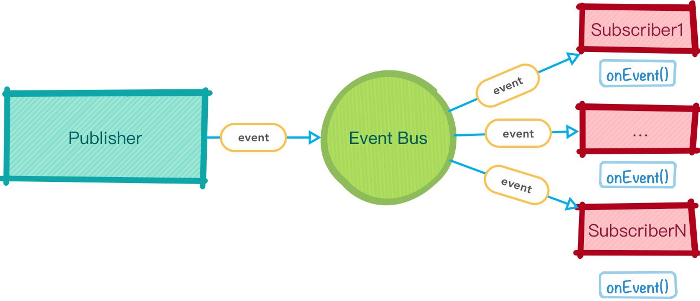
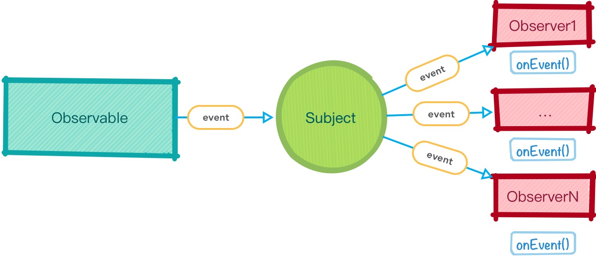

# 使用 Subject 作为 Event Bus

由于 Subject 具有 Observer 的身份，所以我们可以通过 `next(value)` 方法 **主动** 的向它推送值：

```js
const subject = new Rx.Subject();

const observerA = {
  next: x => console.log(`A next ${x}`),
  error: e => console.error(`A error ${e}`),
  complete: () => console.log('A done')
};

subject.subscribe(observerA);

const observerB = {
  next: x => console.log(`B next ${x}`),
  error: e => console.error(`B error ${e}`),
  complete: () => console.log('B done')
};

setTimeout(() => {
  subject.subscribe(observerB);
}, 2000);

subject.next(1);
subject.next(2);
subject.next(3);

/* 程序输出：
  "A next 1"
  "A next 2"
  "A next 3"
 */
```

[查看例子](http://jsbin.com/nesazu/11/edit?js,console)

基于此，Subject 可以用来实现 Event Bus：

<div style="text-align:center">
</img>
</div>

Event Bus 即事件分派器，是一个[ Pub/Sub（发布与订阅） 模型](https://www.wikiwand.com/en/Publish%E2%80%93subscribe_pattern)，他负责接收 **发布者** 发布的事件，并将该事件分派给各个订阅了该事件（即创建了该事件的回调）的 **订阅者**。

使用 RxJS 中的 Subject，可以将 Event Bus 表示为：

<div style="text-align:center">
</img>
</div>

例如，在下面的 React Component 中我们使用 Subject 来作为点击事件的分配器：

```js
class Hello extends React.Component {
  constructor() {
    super();

    this.state = {
      count: 0
    };

    this.subject = new Rx.Subject();

    this.subject
      .mapTo(1)
      .scan((acc, curr) => acc + curr)
      .delay(1000)
      .subscribe({
        next: v => this.setState({count: v})
      });
  }

  render() {
    return (
      <div onClick={evt => this.subject.next(evt)} >
        {`${this.state.count} Hello ${this.props.name}`}
      </div>
    );
  }
}

ReactDOM.render(
  <Hello name="Egghead" />,
  document.querySelector('#app')
);
```

[查看例子](http://jsbin.com/nesazu/14/edit?js,output)

在这段代码中，通过 `this.subject.next(evt)` 完成了点击事件的分配，订阅者将通过 `this.setState({count: v})` 更新组件状态。

## 警告！a

但是，将 Subject 作为 Event Bus 是不推荐的。试想，当我们频繁使用 `subject.next(value)` 时，就频繁地作出主动控制，这显然和响应式程序设计背道而驰了。在响应式程序设计中，我们应当是：**对到来的各个事件，被动地作出响应**，而不是主动地去控制事件流。
